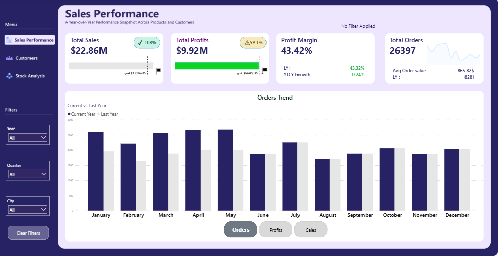

# 📊 Sales, Customer & Stock Performance Analytics

## 🎯 Project Overview
This project is an end-to-end, highly interactive Business Intelligence dashboard designed to provide a 360-degree view of corporate performance. It empowers stakeholders and decision-makers to track KPIs, analyze customer behavior, and monitor inventory movements through advanced DAX logic and dynamic filtering.

## 🛠️ Key Features & Technical Highlights

### 1. Sales Performance (Executive View)
* **Smart KPI Architecture:** Utilizes modern cards with embedded sparklines and target tracking. Reference labels are heavily used to display Last Year (LY) and Year-Over-Year (YoY) growth without cluttering the UI.
* **Space Optimization:** Instead of multiple static charts, a single dynamic Column Chart compares Current vs. Last Year data.
* **Parameter Switching:** A built-in Button Slicer allows users to instantly toggle the entire page's context between Sales, Profits, and Orders.
* **Context-Rich Tooltips:** Custom report page tooltips dynamically update based on the selected metric, showing Top 5 Cities, Top 5 Products, and YoY growth for any specific month hovered.

**

---

### 2. Customers Analysis (Deep Dive & Geolocation)
* **Advanced Tabular Visuals:** The Top 20 Customers table integrates in-cell data bars for visual baseline comparisons between the current and previous year.
* **Conditional Formatting Logic:** Highly customized $\Delta$ YoY variance and percentage columns using color-coded text and icons to instantly flag churn risks or growth accounts.
* **Geospatial Insights:** Azure Maps integration highlights geographic sales density, cross-filtered with the Top 10 Selling Cities.
* **Interactive Cross-Filtering:** Hovering over any customer or city instantly filters a custom tooltip revealing their specific Top 5 purchased products.

*(Drag and drop your Customer_Analysis.png and Customers ToolTip image here)*

---

### 3. Stock Analysis (Self-Service Analytics)
* **Dynamic What-If Ranking:** Built a highly complex DAX architecture allowing end-users to dynamically rank products. Users can toggle between **Top** or **Bottom** performers, and manually adjust the **N-value** (e.g., Top 3, Bottom 5, Top 15) on the fly.
* **Measure Swapping:** The dynamic ranking is fully integrated with a button slicer, meaning the Top/Bottom N logic seamlessly recalculates across Sales, Profits, or Orders.
* **Inventory Distribution:** Clean visualizations tracking the percentage of sales by Buying Package and Most Ordered Colors to assist supply chain and inventory decisions.

*(Drag and drop your Stock Analysis.png here)*

---

## 🧠 Technical Skills Applied
* **Advanced DAX:** Calculation Groups, Field Parameters, Dynamic Ranking (`RANKX`, `TOPN`), and customized conditional formatting measures.
* **Data Modeling:** Robust relational model handling multiple fact and dimension tables.
* **UI/UX Design:** Implemented dynamic header text (e.g., `Filters Applied >> Year: 2015`) to maintain state awareness, clear navigation menus, and clean whitespace management for executive reporting.

---
💡 *Note: The full interactive `.pbix` file and the exported PDF summary are available in the repository files above.*
